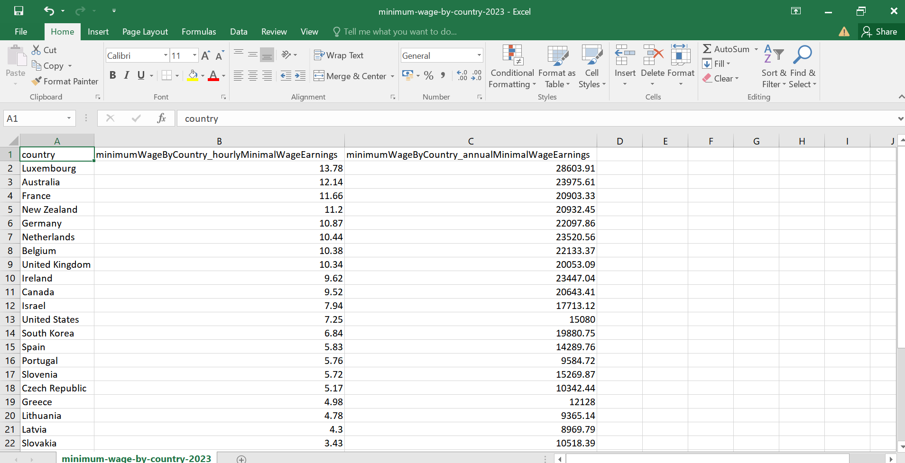
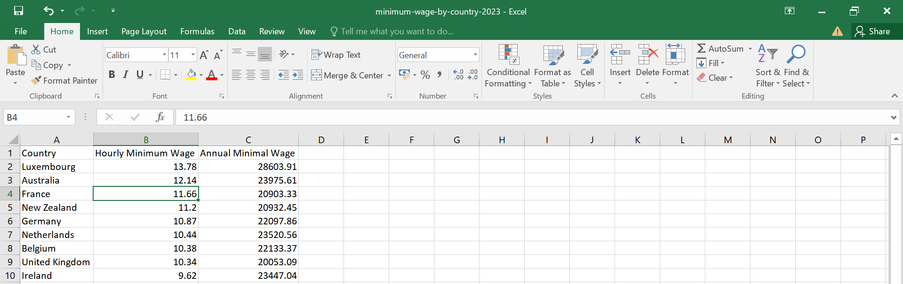
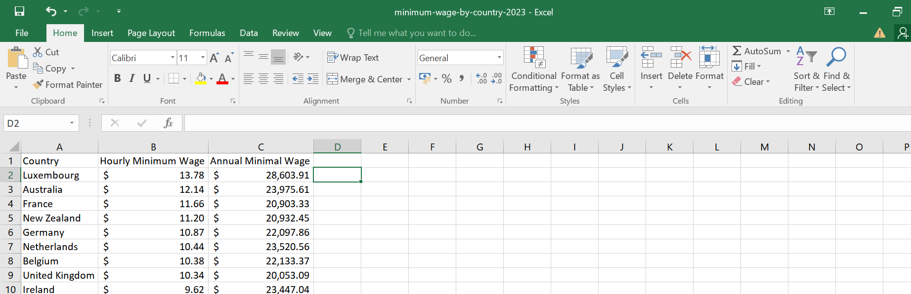
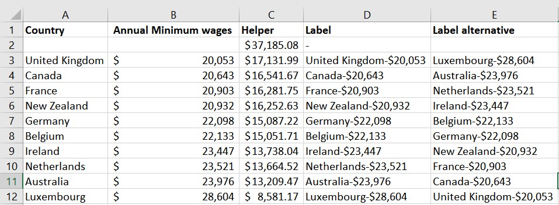
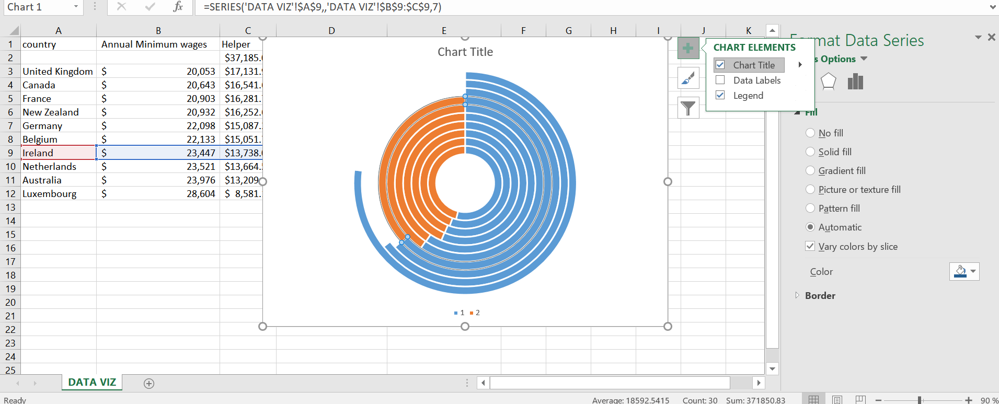
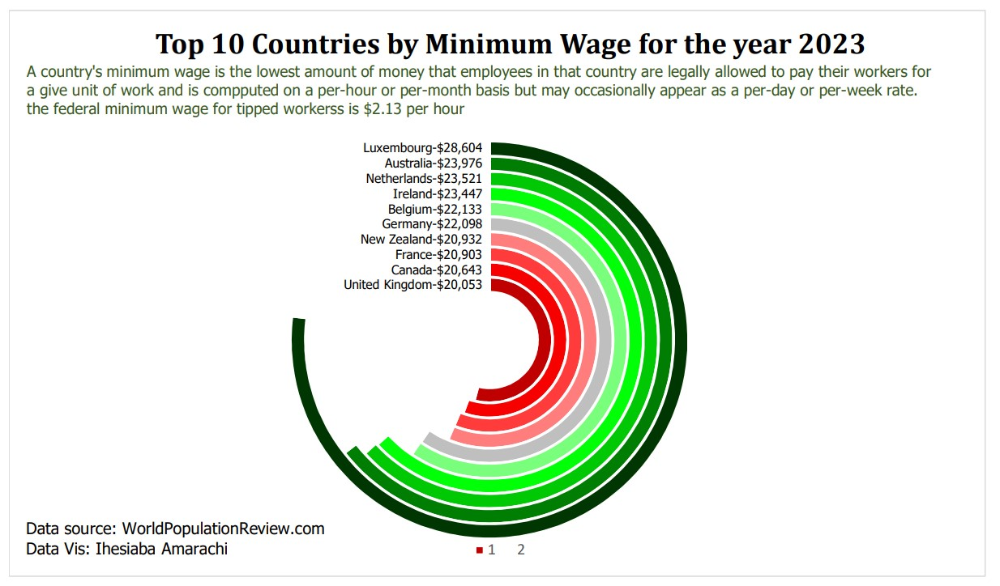

# 2023-minimum-Wage-by-countries

This Repository contains a brief analysis of top minimum wages by Countries for the year 2023. #minimum-wage 
## Introduction
This analysis was inspired by recent journey into the job market, whilst trying to figure out how best to utilise my skills in the global market and the visualisation utilised here was from a tweet by [DohBams](https://twitter.com/DOh_Bams) i had bookmarked years prior.

## Data Sourcing
This Data was gotten from [worldpopulationreview.com](https://worldpopulationreview.com/country-rankings/minimum-wage-by-country)
The Initial Dataset contained one sheet: minimum-wage-by-country-2023 that contained 32 Rows and 3 columns(
- Countries,
- minimumWageByCountry_hourlyMinimalWageEarnings,
- minimumWageByCountry_annualMinimalWageEarnings)

## Skills/ Concepts exhibited
The following Microsoft Excel skills were integrated:
- Data cleaning
- Aggregate functions
- Filters and Sort
- Flashfill
- Data Visualisation(using Charts)

## Data Transformation/ Cleaning
- Deleted the column "minimumWageByCountry_hourlyMinimalWageEarnings"
  
- Edited the Columd header of "minimumWageByCountry_annualMinimalWageEarnings" to Annual Minimum wages"
- Filters the Dataset to reflect only the top 10
- Sorted the column "Annual Minimum wages" by smallest to largest
- Changed the Datatype of  "Annual Minimum wages" to Currency

 Initial datatype                | final datatype           
:-------------------------------:|:-------------------------------:
        |         

_[Attached](https://drive.google.com/file/d/1p3ktQNfwmYJDSRMbg7W7A926vH-lgsr2/view?usp=share_link) is a copy of the cleaned and transformed Data_
## Data Analysis and Visuals
- Created columns "Helper" and "label"
- Inserted an empty row just beneath the column headers
- Under the column header "Helper" i calculated "=MAX(B3:B12)*1.3" to help check the percentage increment and ensure that the values are tallying
- I subtracted the subsequent columns from the Calculated cell
- The column "Label" contains the concatenated values of the country and their annual minimum wage

- The visualisation used is called a **Radial Chart** and is a derivative of the Donot Chart

You can check out the report [here](https://drive.google.com/file/d/1QP85ZtlC7K_Oi_9A16nhOME2PzSojK4v/view?usp=share_link)

